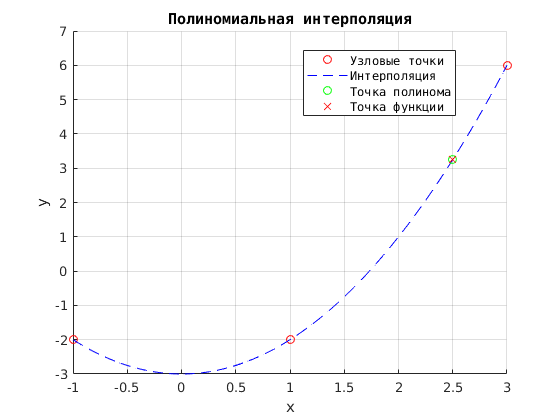
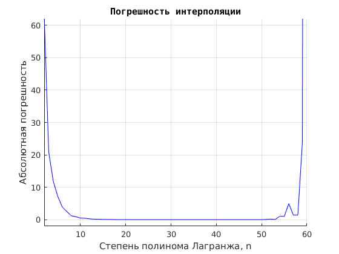
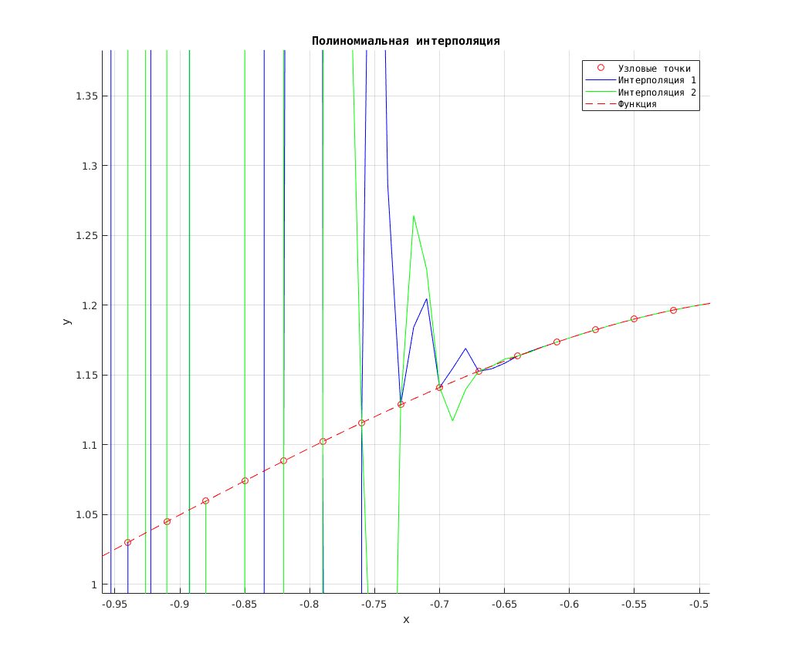
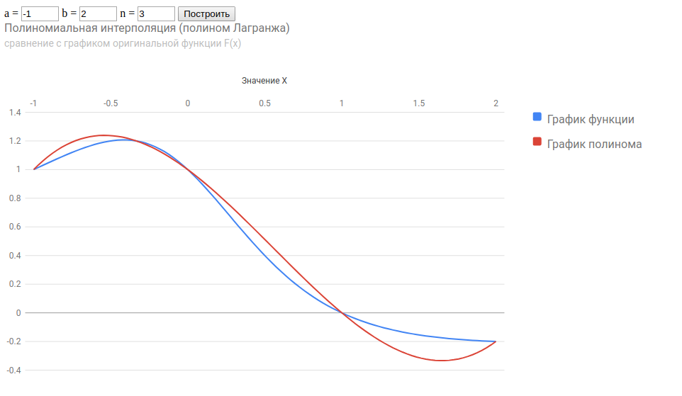

# Численные методы

## Лабораторная работа № 1
## "Численные исследования метода интерполяции многочленом Лагранжа"

[Задание:](./NM/Lab01/%D0%97%D0%B0%D0%B4%D0%B0%D0%BD%D0%B8%D0%B501.txt)

1. Написать программу, исходные данные: дан отрезок [a, b] - вводим с клавиатуры,
и функция, по которой будем считать значения в узлах. Используем многочлен второй степени (3 узла),
и они равноотстощие на отрезке [a, b]. С помощью двойного цикла запрограммировать вычисление
многочлена Лагранжа в произволной точке x.

2. Функция f задана таблицей значений. Найти с помощью многочлена Лагранжа L2(x) приближенное значение
функции в точках x* = 1.5 и x** = 2.5 

UPD: [Решение на С++](./NM/Lab01/c%2B%2B)
UPD: [Решение на С++ с графиком на OpenGL](./NM/Lab01/c%2B%2BPlot)
UPD: [Решение на Matlab](./NM/Lab01/matlab)
UPD: [Решение на Python](./NM/Lab01/py/Lab01.ipynb)
UPD: [Решение на C#](./NM/Lab01/c%23/Lab01)
UPD: [Решение на JavaScript](./NM/Lab01/js)

## Отчет л.р. №1 [Word](https://cloud.mail.ru/public/JRUV/mpLoobjWK) и [PDF](https://cloud.mail.ru/public/5dKV/awM2Yxyij)
### Демо на JavaScript [Демо](http://io.do.am/index/laboratornaja-rabota-1-chislennye-metody-js/0-5)
### Методичка к лаб.раб. №1 [Гудович Н.Н. Методичка №1](https://cloud.mail.ru/public/3nsf/EusLapYc2)
-------


## Трекинг и описание


### 2017-09-15, UPD 2017-10-05
#### Добавлено решение задачи №1 (С++)
[Задание:](./NM/Lab01/%D0%97%D0%B0%D0%B4%D0%B0%D0%BD%D0%B8%D0%B501.txt)
(интерполяция полиномом Лагранжа)

1. Написать программу, исходные данные: дан отрезок [a, b] - вводим с клавиатуры,
и функция, по которой будем считать значения в узлах. Используем многочлен второй степени (3 узла),
и они равноотстощие на отрезке [a, b]. С помощью двойного цикла запрограммировать вычисление
многочлена Лагранжа в произволной точке x. --- См. interpolate1

```cpp
double interpolate1(double a, double b, int size, double xx, func f);
```

2. Функция f задана таблицей значений. Найти с помощью многочлена Лагранжа L2(x) приближенное значение
функции в точках x* = 1.5 и x** = 2.5  --- См. interpolate2

```cpp
double interpolate2(vector<double> X, vector<double> Y, double xx);
```

UPD 2017-10-05: сделал вывод графика на [OpenGL](https://www.opengl.org/) с использованием бибилиотеки [glut](https://www.opengl.org/resources/libraries/glut/).
Выглядет пока довольно корявенько, многое приходится делать ручками, например, вывод осей, сетки, засечек, расчет смешения от центра. Пока вот как-то так:


Работает на Windows / разработка в Visual Studio 2017, под линукс пока не запустил, надо попробовать позже.
Вот тут [ссылка](https://www.opengl.org/resources/libraries/glut/) на необходимые библиотеки, а вот [неплохой видео мануал](https://www.youtube.com/watch?v=bIcT61FdG-Y), как все это подключить к Visual Studio и заставить работать.

LINK: [Решение на С++](./NM/Lab01/c%2B%2B)
UPD: [Решение на С++ с графиком на OpenGL](./NM/Lab01/c%2B%2BPlot)

-------


### 2017-09-15
#### UPD: добавил решение задачи №1 (Matlab) с выводом графиков.
[Задание:](./NM/Lab01/%D0%97%D0%B0%D0%B4%D0%B0%D0%BD%D0%B8%D0%B501.txt)
(интерполяция полиномом Лагранжа)

В папке две основные функции: [interpolate1.m](./NM/Lab01/matlab/interpolate1.m) и [interpolate2.m](./NM/Lab01/matlab/interpolate2.m)
Сама исходная оригинальная функция, по которой рассчитываются узлы, в файле [f.m](./NM/Lab01/matlab/f.m). 
Чтобы вызвать рассчет интерполяции, зная только границы отрезка и точку x (пусть она = 2.5), необходимо в командной строке матлаба ввести и выполнить:
```matlab
[Lx, Fx, d] = interpolate1(-1, 3, 2, 2.5)
```
Чтобы вызвать рассчет интерполяции по известным узлам, необходимо в командной строке матлаба сначала сформировать эти узлы, например:
```matlab
X = [1; 2; 3];
Y = [-2; 1; 6];
```
а затем уже выполнить по ним интерполяцию для точки x = 2.5:
```matlab
[Lx, Fx, d] = interpolate2(X, Y, 2.5)
```
Или можно выполнить в командной строке файл [main.m](./NM/Lab01/matlab/main.m), в котором все это уже есть с комментариями.
В итоге сформируется новое окно с графиком такого вида:



LINK: [Решение на Matlab](./NM/Lab01/matlab)

-------


### 2017-09-20
#### UPD: добавил решение задачи №1 на Python (Jupyter Notebook) с выводом графиков.

UPD: [Решение на Python](./NM/Lab01/py/Lab01.ipynb)

-------


### 2017-09-24
#### UPD: добавил к решению задачи №1 (Matlab) вывод полного графика функции и графика полинома.
Все оформлено в отдельную функцию без возвращаемых параметров [interpolate3.m](./NM/Lab01/matlab/interpolate3.m), вызов следующего вида (как пример):

```matlab
interpolate3(a, b, size)
```
где a и b - концы отрезка, size - степень полинома Лагранжа.
Получим окно с графиком:


Кроме того, добавил пару функций для расчета абсолютной погрешности: [delta.m](h./NM/Lab01/matlab/delta.m) и [deltaPlot.m](./NM/Lab01/matlab/deltaPlot.m). Первая из них вычисляет погрешность между функцией и полиномом Лагранжа, вторая строит график зависимости погрешности от степени полинома Лагранжа:

```matlab
deltaPlot(a, b, size1, size2)
```
где a и b - концы отрезка, size1 и size2 - начальная и конечная степень полинома Лагранжа.
Получим окно с графиком:



UPD: [Решение на Matlab](./NM/Lab01/matlab)

-------


### 2017-09-24
#### UPD: добавил [решение](./NM/Lab01/c%23/Lab01) на C# на основе [WinForms](https://ru.wikipedia.org/wiki/Windows_Forms) и свободной библиотеки [ZedGraph](http://zedgraph.sourceforge.net/samples.html).
Окошко имеет вид:


UPD: [Решение на C#](./NM/Lab01/c%23/Lab01)

-------


### 2017-09-24
#### UPD: к решению на MatLab добавил два дополнительных модуля: [polyval1.m](./NM/Lab01/matlab/polyval1.m) и [polyval2.m](./NM/Lab01/matlab/polyval2.m), а также вызывающую их вспомогательную функцию [interpolate4diff.m](./NM/Lab01/matlab/interpolate4diff.m).

В модуле [polyval1.m](./NM/Lab01/matlab/polyval1.m) вычисление значения интерполяционного многочлена в точке реализовано таким образом, чтобы в одном цикле выполнялось и умножение, и
деление на знаменатель, а в модуле [polyval2.m](./NM/Lab01/matlab/polyval2.m) эти вычисления разнесены на два цикла, по одному на вычисление числителя и на вычисление знаменателя.
На рисунке ниже приведены результаты работы функции [interpolate4diff.m](./NM/Lab01/matlab/interpolate4diff.m) для степени интерполяционного многчлена равной 100. Синим цветом выведен график
полинома, значения точек которого посчитаны методом модуля [polyval1.m](./NM/Lab01/matlab/polyval1.m), а зеленым – модуля [polyval2.m](./NM/Lab01/matlab/polyval2.m).



UPD: [Решение на Matlab](./NM/Lab01/matlab)

-------


### 2017-09-29
#### UPD: добавил отчет л.р. №1 [Word](https://cloud.mail.ru/public/JRUV/mpLoobjWK) [PDF](https://cloud.mail.ru/public/5dKV/awM2Yxyij)

-------


### 2017-10-01
#### UPD: добавил [решение](./NM/Lab01/js) на JavaScript с использованием [Google Charts](https://developers.google.com/chart/).
Внешний вид странички html с работающим скриптом:



UPD: [Решение на JavaScript](./NM/Lab01/js)
UPD: [Демо](http://io.do.am/index/laboratornaja-rabota-1-chislennye-metody-js/0-5)

-------


### 2017-10-02
#### UPD: добавил к [решению](./NM/Lab01/js) на JavaScript демку на сайте io.do.am.
Посмотреть можно тут:

UPD: [Демо](http://io.do.am/index/laboratornaja-rabota-1-chislennye-metody-js/0-5)

-------


### 2017-10-05
#### UPD: добавил [решение](./NM/Lab01/c%2B%2BPlot) на C++ с выводом графиков на OpenGL.

UPD: [Решение на С++ с графиком на OpenGL](./NM/Lab01/c%2B%2BPlot)

-------