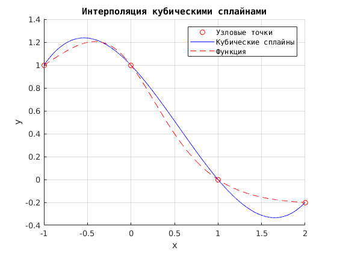
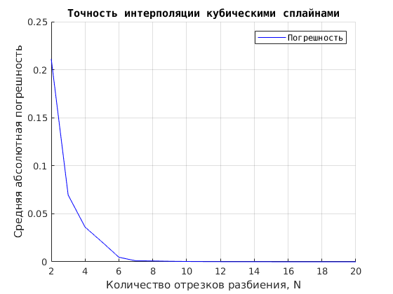

# Численные методы

## Лабораторная работа № 4
## "Численное исследование приближения функции методом кубических сплайнов при увеличении количества отрезков разбиения"

[Задание:](./NM/Lab04/%D0%97%D0%B0%D0%B4%D0%B0%D0%BD%D0%B8%D0%B504.txt)

1. Составить и отладить программу приближенного нахождения значения функции с использованием методом интерполяции кубическими сплайнами.
Запрограммировать вычисление аппроксимирующего многочлена в произвольной точке x* отрезка [a, b].


2. Построить графики и сравнить с графиком функции, сделать выводы, написать отчет.

UPD: [Решение на Matlab](./NM/Lab04/matlab)

## Отчет л.р. №4 [Word](https://cloud.mail.ru/public/9ok7/ozrmF7Qnm) и [PDF](https://cloud.mail.ru/public/5Pny/ynbZeF6jm)
### Теория к лаб.раб. №4 [Гудович Н.Н. Элементы численных методов. Вып 4. Кубические сплайны](https://cloud.mail.ru/public/FKum/kPAac3XDU)
-------


## Трекинг и описание


### 2017-12-06
#### UPD: добавил решение лабораторной №4 (Matlab) с выводом графиков.
[Задание:](./NM/Lab04/%D0%97%D0%B0%D0%B4%D0%B0%D0%BD%D0%B8%D0%B504.txt)
(метод кубических сплайнов)

В папке несколько функциональных блоков. Расчет коэффициентов интерполяционных кубических сплайнов реализован в блоке:

- [coefSpline.m](./NM/Lab04/matlab/coefSpline.m) - модуль, реализующий вычисление коэффициентов.

Для вычисления значений функции F(x) для узла x использовался реализованный ранее в первых двух лабораторных работах модуль f.m.


Модуль coefSpline получает на вход в качестве параметров концы отрезка [a, b] и количество подотрезков (отрезков разбиения исходного отрезка, то есть количество сплайнов), возвращая двумерный массив коэффициентов всех найденных сплайнов, в котором каждая строка – набор коэффициентов
кубического сплайна.

Вызов модуля осуществляется командой:

```matlab
coefSpline (a, b, N)
```
Модуль возвращает матрицу коэффициентов С, чтобы затем на ее основе можно было рассчитать значение интерполяционного сплайна в любой точке внутри
отрезка [a, b].

Модуль [coefSpline.m](./NM/Lab04/matlab/coefSpline.m) пполучает в качестве передаваемых параметров концы отрезка [a, b], количество подотрезков разбиения N и значение x, для которого надо посчитать Spline(x): 
```matlab
Spline_x = pointSpline (a, b, N, x) 
```

Построение графиков выполняют следующие модули:
- [plotSpline.m](./NM/Lab04/matlab/plotSpline.m) – выводит график сплайна, совмещенный с графиком функции и
узловыми точками;
- [plotDeltaSpline.m](./NM/Lab04/matlab/plotDeltaSpline.m) – выводит совмещенные графики зависимости средней
абсолютной ошибки интерполяции от количества отрезков разбиения N;
- [deltaSpline.m](./NM/Lab04/matlab/deltaSpline.m) – вспомогательный модуль для расчета средней абсолютной
ошибки интерполяции.


Вызываются эти модули следующим образом:

```matlab
plotSpline(a, b, N)

plotDeltaSpline(a, b, N_start, N_end)

deltaSpline(Y1, Y2) 
```

где a и b - границы отрезка, N – количество отрезков разбиения, N_start, N_end – начальное и конечное значение диапазона перебора числа узловых точек.

При построении графиков равноотстоящие узлы интерполяции дополняются промежуточными точками, поскольку узловых точек недостаточно для демонстрации расхождения графиков (в узловых точках они совпадают). 


В результате работы модулей сформируются новые окна с совмещенными графиками такого вида (пример):




UPD: [Решение на Matlab](./NM/Lab04/matlab)

-------


### 2017-12-06
#### UPD: добавил отчет л.р. №4 [Word](https://cloud.mail.ru/public/9ok7/ozrmF7Qnm) и [PDF](https://cloud.mail.ru/public/5Pny/ynbZeF6jm)

-------